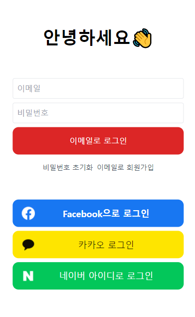

# fastcampus 로그인 & 게시판 따라하기



.env 파일에 아래 내용 설정 필요.

```
NAVER_CLIENT_ID=
NAVER_CLIENT_SECRET=
FB_APP_ID=
FB_CLIENT_ID=
KAKAO_JAVASCRIPT_KEY=
KAKAO_REST_KEY=

MONGO_PASSWORD=
MONGO_CLUSTER=
MONGO_USER=
MONGO_DBNAME=

SERVER_SECRET=

AWS_REGION=
AWS_ACCESS_KEY_ID=
AWS_SECRET_ACCESS_KEY=
EMAIL_ADD=

NGROK_URL=
```

## 플로우별 처리 과정

## OAuth flow

- Vendors
  - Naver
  - Facebook
  - Kakao
- 각각의 OAuth provider에 개발자 계정을 만들고 설정해야함.
- access token -> (platformUserId, platform) -> 회원가입/로그인 처리
- HTTPS -> ngrok으로 처리.

## 이메일 가입

- 인증 상태를 확인할 필요가 있음 -> 유저 정보에 `verified` 라는 필드가 있어야 함.
- `verified` 필드가 `false`이면 정상적인 활동 불가능.
- 이메일 인증은 특수한 코드와 함께 이메일을 보내서 그 링크로 접속했을 때만 인증이 되게 처리.
  - "다음 링크로 들어와 인증을 마무리해 주세요: https://somewhere/verify_email/code-abcde-defsd-123-sdsds"
  - 위 링크로 `GET`해서 들어오면 `verifier`를 `true`로 바꿔줌
- AWS(route53) -> SES(simple email service)로 인증 메일을 보낼 것

  - route 53 생성 : 도메인등록을 통해 도메인 구입
  - ses 생성 : verify a new domain통해 내가 구입한 도메인 인증
    - create record set을 통해 인증에 필요한 레코드셋 생성
    - 개인 이메일도 aws 내에서 바로 인증 가능
    - 도메인과 이메일주소를 등록해 여러 계정으로 메일을 받을 수 있음
  - IAM 생성 : 메일을 실제로 보내거나 하려면 아마존 계정이 우리 것임을 노드서버에서 인증해야함
    - 사용자 추가 및 프로그래밍엑세스 추가
    - 권한 추가(SES full access)
    - {엑세스 키 ID, 비밀 엑세스 키} 환경변수에 메모

- 비밀번호 초기화
  - 비밀번호 찾기는 지원하지 않습니다. 찾기가 가능하다는것은 양방향 변환(복호화, 암호화)이 가능하거나, plain text로 저장이 되어 있다는 뜻. 해시 펑션(one-way function)을 사용해 값을 데이터베이스에 저장.
  - 유저가 처음 가입한 해당 이메일로 인증 메일과 비슷하게 초기화 링크를 담은 메일을 보낸다.
  - 해당 링크를 타고 들어오면 그 때 드록해두었던 비밀번호(바꾸고자 하는 비밀번호)로 기존 비밀번호를 갱신시킵니다.

## 배포

AWS를 사용해서 배포합니다.

- EC2 (server)
  - git 레포지토리를 clone해서 배포
  - 인스턴스 > 연결 tmux 이용(aws 셀이 종료되도 유지 가능하도록(nohub 이나 pm2도 가능))
- HTTPS 지원 - Amazon 인증서.
- ELB(Elastic Load Balancer)를 사용해 여기에 인증서를 올리고, ELB가 위의 EC2를 바라보게 함.
- SES를 통해 메일 처리
- 데이터베이스는 MongoDB를 사용.
- 로깅 : pino-http
- 보안 : helmet

reference : https://github.com/JeongHoJeong/fastcampus-2021-node-project
